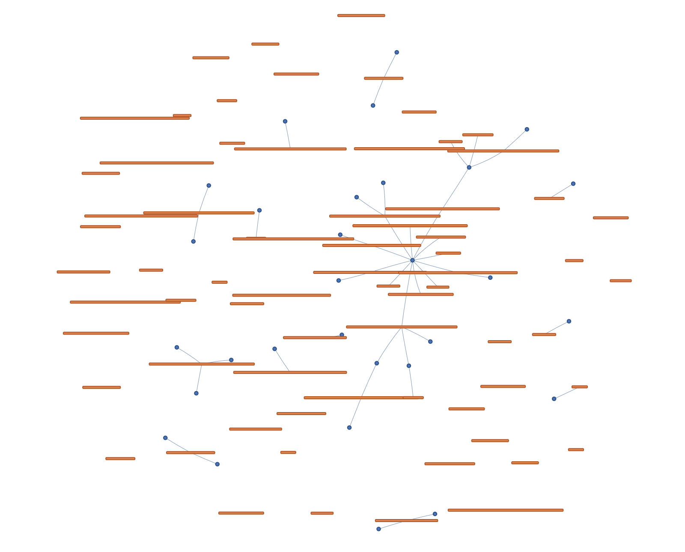

# Layer10 Assignment: Grounded Memory Graph

This repository is a complete end-to-end pipeline that lets you extracts structured claims from GitHub issues, deduplicate them with semantic embeddings, and then construct a grounded, explorable memory graph, you can retrieve information from.

## Project Structure
* `layer10.ipynb`: The primary Jupyter Notebook containing the end-to-end pipeline (Data Download $\rightarrow$ Extraction $\rightarrow$ Embedding $\rightarrow$ Clustering $\rightarrow$ Graph Construction $\rightarrow$ Retrieval).
* `requirements.txt`: Python dependencies.
* `outputs/`: Directory where serialized graph data (`memory_graph.graphml`), DataFrames, and embeddings are saved.
* `visualization/`: Contains the generated PyVis interactive graph (`graph.html`).
* `retrieval_examples/`: Contains JSON context packs generated by the retrieval API.

## Prerequisites
* Python 3.9+
* Jupyter Notebook

## Setup & Installation
1. Clone the repository and navigate to the project directory.
2. Install the required dependencies:
   ```bash
   pip install -r requirements.txt
3. Download the necessary spaCy English language model:
   ```bash
   python -m spacy download en_core_web_sm

## Running the Pipeline

1. **Launch Jupyter Notebook:**

```bash
jupyter notebook
```

2. Open `layer10.ipynb` and execute the cells sequentially.

3. **Data Ingestion:**  
   The notebook will automatically pull the latest 500 issues and their comments from the `pandas-dev/pandas` repository via the public GitHub API.

   *Note: Unauthenticated GitHub API requests are rate-limited. The script includes minor sleep delays to handle this, but execution may take a few minutes.*

4. **Visualization:**  
   Upon completing the notebook, open `visualization/graph.html` in your web browser to interactively explore the generated memory graph.

## Evaluating Retrieval

The final cells of the notebook demonstrate the retrieve_context(question) function. It accepts a natural language query and outputs a grounded "context pack" of canonical claims and their exact supporting evidence. Example outputs are saved to the retrieval_examples/ directory.

<p align="center">

<br>
<em>Graph in browser</em>
</p>